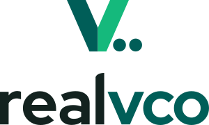
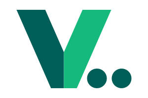
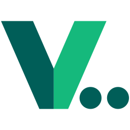
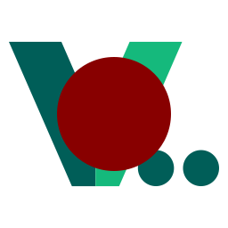

<picture>
  <source media="(prefers-color-scheme: dark)" srcset="realvco-lockup-260813.svg">
  
</picture>

# realvco brand assets

Public mirror of the realvco logo, mark, lockups and favicons. Everything here is a plain SVG (plus one `.ico`) — no build step, no dependencies.

**Direct link:** `https://raw.githubusercontent.com/realvco/public/main/<filename>`

Current assets live in the **repo root**. The `logos/` and `images/` folders hold the previous generation and are kept only so existing links keep working.

---

## Current assets (v2.5)

Previews below switch with your GitHub theme — you are seeing the variant meant for your current background.

### Lockup — horizontal

The primary mark. Symbol and wordmark share the same cap height and sit on the same baseline. Ink box **360 × 60**, a clean **6 : 1** — so the width is always the height × 6.

<picture>
  <source media="(prefers-color-scheme: dark)" srcset="realvco-lockup-260813.svg">
  
</picture>

`realvco-lockup-260813.svg` (dark backgrounds) · `realvco-lockup-260813-light.svg` (light backgrounds)

### Lockup — stacked

For square-ish slots: app splash screens, slide covers, social profiles. Ink box **300 × 180**, exactly **5 : 3**.

<picture>
  <source media="(prefers-color-scheme: dark)" srcset="realvco-lockup-stacked-260813.svg">
  
</picture>

`realvco-lockup-stacked-260813.svg` · `realvco-lockup-stacked-260813-light.svg`

### Symbol only

The letter **v** lifted out of the wordmark, widened and thickened so it survives at small sizes, with two cursor dots tucked into the empty wedge under the right arm. Use it where the brand name already appears elsewhere.

Canvas **300 × 200** (3:2) with the symbol centred at 80% height — **the padding is already built in**, so do not add your own or you will get a double margin. The symbol itself measures 233 × 160 inside that canvas.

<picture>
  <source media="(prefers-color-scheme: dark)" srcset="realvco-mark-260813.svg">
  
</picture>

`realvco-mark-260813.svg` · `realvco-mark-260813-light.svg`

### Wordmark only

No symbol. For tight horizontal space, or when the symbol is already shown nearby. **300 × 75**.

<picture>
  <source media="(prefers-color-scheme: dark)" srcset="realvco-logo-260813.svg">
  
</picture>

`realvco-logo-260813.svg` · `realvco-logo-260813-light.svg`

### Favicon

All three are 256 × 256, with the symbol inset 2 px from the left and right edges.

**`realvco-favicon-auto-260813.svg` — one file for both themes.** It carries an embedded `prefers-color-scheme` rule, so it recolours itself. This is the one to put in a browser tab. Read the callout below before using it anywhere else.

**`realvco-favicon-260813.svg` / `realvco-favicon-260813-light.svg` — fixed colours, no switching.** Same geometry, palette baked in. Use these wherever the background is pinned to a known colour, or wherever an embedded `<style>` block would be stripped or ignored.

<picture>
  <source media="(prefers-color-scheme: dark)" srcset="realvco-favicon-260813.svg">
  
</picture>

`realvco-favicon-260813.ico` — raster fallback for older browsers, 16/32/48/64 px. Static; it uses the light-background palette because that is the set with the better worst case across tab-bar colours.

### Favicon — reinstall state

Same symbol with a red status dot. Used by the admin console while a machine is being reinstalled, so the tab is recognisable at a glance.

`realvco-favicon-reinstall-260813.svg`

---

## Which file do I use?

| I need… | File |
|---|---|
| Browser tab icon | `realvco-favicon-auto-260813.svg` |
| Small square icon on a fixed background | `realvco-favicon-260813(-light).svg` |
| Logo in a header or footer | `realvco-lockup-260813(-light).svg` |
| Square slot — app icon, avatar, splash | `realvco-lockup-stacked-260813(-light).svg` or the symbol |
| Just the symbol | `realvco-mark-260813(-light).svg` |
| Just the name | `realvco-logo-260813(-light).svg` |

**Pick `-light` for light backgrounds, the plain name for dark backgrounds.**

> [!IMPORTANT]
> **Do not use `realvco-favicon-auto-260813.svg` in a slot with a hard-coded background colour.**
> Its `prefers-color-scheme` rule follows the *reader's operating system theme*, not the colour it happens to be sitting on. In a browser tab those two almost always agree, which is why it is right for a favicon. Drop it onto a panel whose background is pinned to a dark colour and a reader on a light-themed OS will get the dark-on-dark version. For fixed backgrounds use `realvco-favicon-260813(-light).svg`, or the `-mark-` / `-lockup-` pairs.

---

## Colours

| Element | Dark backgrounds | Light backgrounds |
|---|---|---|
| Symbol — left arm | `#22EE88` | `#005e58` |
| Symbol — right arm | `#098658` | `#15B97C` |
| Symbol — dots | `#22EE88` | `#005e58` |
| Wordmark "vco" | `#22EE88` | `#005e58` |
| Wordmark "real" | `#f2f6f5` | `#13221F` |

Three rules worth knowing:

- **The left arm is always the higher-contrast face** — bright green on dark, deep teal on light. The two arms sit at a fixed 3.0× contrast ratio in both themes, so the facet reads with the same strength either way.
- **The dots and "vco" both take the left-arm colour exactly.** Three elements, two greens: the left arm (shared by dots and wordmark) and the right arm behind it.
- The two "real" neutrals are the same teal hue family (165° / 168°), so neither theme drifts cool.

A logotype is exempt from WCAG text-contrast rules, so these greens are more saturated than the ones used for interface text. If the green in a logo does not match the green on a button, that is intended.

---

## Clear space and minimum size

- Leave at least the width of one symbol stroke around the lockup.
- Horizontal lockup: do not go below **20 px** tall (120 px wide).
- Symbol on its own: the file includes padding, so below **32 px** of rendered box height the two dots start to merge. At 16 px prefer the `.ico`, or drop the dots.
- Because the symbol canvas is 3:2, give it a 3:2 box. Setting both `width` and `height` to the same value stretches it — there is no `object-fit` fallback on a bare ``.
- Do not recolour, rotate, add effects to, or re-space the lockup. Scale it as a whole.

---

## Previous generation

Kept for backwards compatibility. **Do not use these for anything new.**

`logos/` — earlier wordmark and favicons in the previous bright-green palette, as SVG and PNG. Includes `realvco-logo_woc(-light).svg`, the wordmark with the OpenClaw mascot, which has no v2.5 equivalent yet.

`images/` — `realvco-og.png` (social preview card), `404.webp`, admin console screenshots, and `openclaw-dark.svg`. The OpenClaw mark keeps its own product colours on purpose and is not part of the realvco palette.

> `logos/realvco-logo-light.png` is still linked from outgoing email templates. It cannot be removed until a v2.5 PNG replaces it.

---

## Not here yet

- PNG renders of the v2.5 assets — nothing in the current set is a raster file, so anywhere that cannot take SVG (email bodies, some social platforms, print) still has to fall back to the old logos.
- A refreshed social preview card and 404 illustration.
- A v2.5 treatment for the OpenClaw co-branded wordmark, if it is kept.
