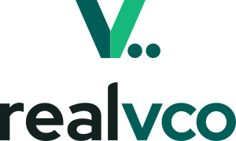
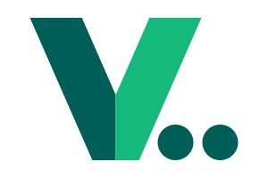
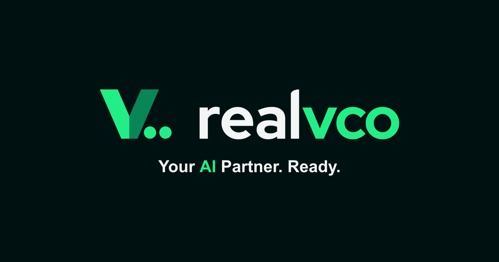
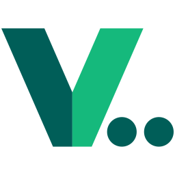
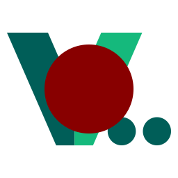
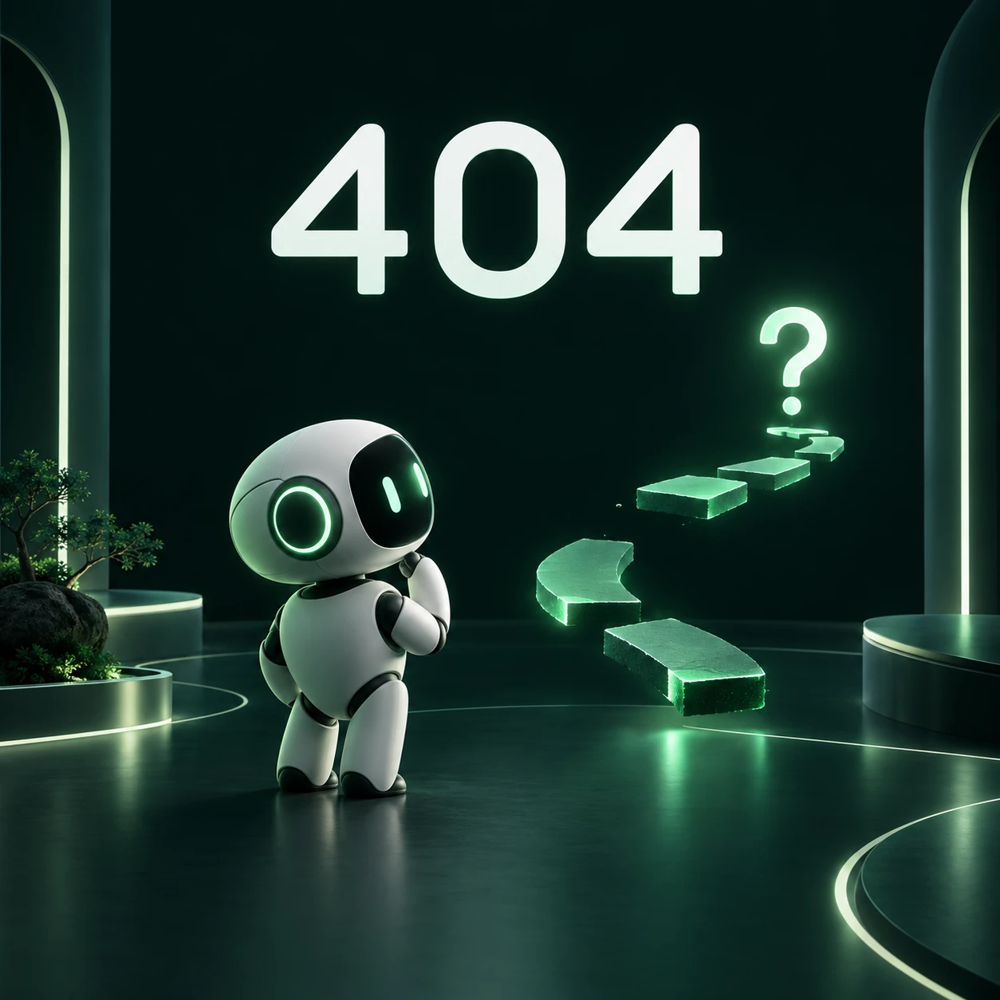

<picture>
  <source media="(prefers-color-scheme: dark)" srcset="realvco-lockup-260813.svg">
  
</picture>

# realvco brand assets

Public mirror of the realvco logo, mark, lockups and favicons. Logo 原檔為 SVG，另提供 `.ico` 與分享圖 PNG；使用這些素材不需要建置或安裝套件。

**Direct link:** `https://raw.githubusercontent.com/realvco/public/main/<filename>`

正式素材放在**根目錄**，包含新版分享圖 `realvco-og.png` 與向量原稿 `realvco-og.svg`。既有網址 `images/realvco-og.png` 保留相同新版圖片；`logos/` 與 `images/` 的其他既有素材保持不變。

---

## Current assets (v2.5)

Previews below switch with your GitHub theme — you are seeing the variant meant for your current background.

### Lockup — horizontal

The primary mark. Symbol and wordmark share the same cap height and sit on the same baseline. Ink box **360 × 60**, a clean **6 : 1** — so the width is always the height × 6.

<picture>
  <source media="(prefers-color-scheme: dark)" srcset="realvco-lockup-260813.svg">
  
</picture>

`realvco-lockup-260813.svg` (dark backgrounds) · `realvco-lockup-260813-light.svg` (light backgrounds)

### Lockup — stacked

For square-ish slots: app splash screens, slide covers, social profiles. Ink box **300 × 180**, exactly **5 : 3**.

<picture>
  <source media="(prefers-color-scheme: dark)" srcset="realvco-lockup-stacked-260813.svg">
  
</picture>

`realvco-lockup-stacked-260813.svg` · `realvco-lockup-stacked-260813-light.svg`

### Symbol only

The letter **v** lifted out of the wordmark, widened and thickened so it survives at small sizes, with two cursor dots tucked into the empty wedge under the right arm. Use it where the brand name already appears elsewhere.

Canvas **300 × 200** (3:2) with the symbol centred at 80% height — **the padding is already built in**, so do not add your own or you will get a double margin. The symbol itself measures 233 × 160 inside that canvas.

<picture>
  <source media="(prefers-color-scheme: dark)" srcset="realvco-mark-260813.svg">
  
</picture>

`realvco-mark-260813.svg` · `realvco-mark-260813-light.svg`

### Wordmark only

No symbol. For tight horizontal space, or when the symbol is already shown nearby. **300 × 75**.

<picture>
  <source media="(prefers-color-scheme: dark)" srcset="realvco-logo-260813.svg">
  
</picture>

`realvco-logo-260813.svg` · `realvco-logo-260813-light.svg`

### 社群分享圖

`realvco-og.png` — **1200 × 630**，使用 v2.5 深色背景版橫式 Logo，保留原標語與背景色，取代舊版龍蝦角色分享圖。根目錄為主要使用位置；`images/realvco-og.png` 保留完全相同的圖片，讓既有連結持續可用。

`realvco-og.svg` — 可編輯的向量原稿；Logo 路徑、比例與配色直接取自 `realvco-lockup-260813.svg`，標語使用 Arial。PNG 已完成輸出，可直接用於社群分享。

### Favicon

All three are 256 × 256, with the symbol inset 2 px from the left and right edges.

**`realvco-favicon-auto-260813.svg` — one file for both themes.** It carries an embedded `prefers-color-scheme` rule, so it recolours itself. This is the one to put in a browser tab. Read the callout below before using it anywhere else.

**`realvco-favicon-260813.svg` / `realvco-favicon-260813-light.svg` — fixed colours, no switching.** Same geometry, palette baked in. Use these wherever the background is pinned to a known colour, or wherever an embedded `<style>` block would be stripped or ignored.

<picture>
  <source media="(prefers-color-scheme: dark)" srcset="realvco-favicon-260813.svg">
  
</picture>

`realvco-favicon-260813.ico` — raster fallback for older browsers, 16/32/48/64 px. Static; it uses the light-background palette because that is the set with the better worst case across tab-bar colours.

### Favicon — reinstall state

Same symbol with a red status dot. Used by the admin console while a machine is being reinstalled, so the tab is recognisable at a glance.

`realvco-favicon-reinstall-260813.svg`

---

## Which file do I use?

| I need… | File |
|---|---|
| 社群分享預覽 | 根目錄 `realvco-og.png`；向量原稿 `realvco-og.svg` |
| Browser tab icon | `realvco-favicon-auto-260813.svg` |
| Small square icon on a fixed background | `realvco-favicon-260813(-light).svg` |
| Logo in a header or footer | `realvco-lockup-260813(-light).svg` |
| Square slot — app icon, avatar, splash | `realvco-lockup-stacked-260813(-light).svg` or the symbol |
| Just the symbol | `realvco-mark-260813(-light).svg` |
| Just the name | `realvco-logo-260813(-light).svg` |

**Pick `-light` for light backgrounds, the plain name for dark backgrounds.**

> [!IMPORTANT]
> **Do not use `realvco-favicon-auto-260813.svg` in a slot with a hard-coded background colour.**
> Its `prefers-color-scheme` rule follows the *reader's operating system theme*, not the colour it happens to be sitting on. In a browser tab those two almost always agree, which is why it is right for a favicon. Drop it onto a panel whose background is pinned to a dark colour and a reader on a light-themed OS will get the dark-on-dark version. For fixed backgrounds use `realvco-favicon-260813(-light).svg`, or the `-mark-` / `-lockup-` pairs.

---

## Colours

| Element | Dark backgrounds | Light backgrounds |
|---|---|---|
| Symbol — left arm | `#22EE88` | `#005e58` |
| Symbol — right arm | `#098658` | `#15B97C` |
| Symbol — dots | `#22EE88` | `#005e58` |
| Wordmark "vco" | `#22EE88` | `#005e58` |
| Wordmark "real" | `#f2f6f5` | `#13221F` |

Three rules worth knowing:

- **The left arm is always the higher-contrast face** — bright green on dark, deep teal on light. The two arms sit at a fixed 3.0× contrast ratio in both themes, so the facet reads with the same strength either way.
- **The dots and "vco" both take the left-arm colour exactly.** Three elements, two greens: the left arm (shared by dots and wordmark) and the right arm behind it.
- The two "real" neutrals are the same teal hue family (165° / 168°), so neither theme drifts cool.

A logotype is exempt from WCAG text-contrast rules, so these greens are more saturated than the ones used for interface text. If the green in a logo does not match the green on a button, that is intended.

---

## Clear space and minimum size

- Leave at least the width of one symbol stroke around the lockup.
- Horizontal lockup: do not go below **20 px** tall (120 px wide).
- Symbol on its own: the file includes padding, so below **32 px** of rendered box height the two dots start to merge. At 16 px prefer the `.ico`, or drop the dots.
- Because the symbol canvas is 3:2, give it a 3:2 box. Setting both `width` and `height` to the same value stretches it — there is no `object-fit` fallback on a bare ``.
- Do not recolour, rotate, add effects to, or re-space the lockup. Scale it as a whole.

---

## Previous generation

Kept for backwards compatibility. **Do not use these for anything new.**

`logos/` — 舊配色的 Logo 與網站圖示，保留供既有連結使用。包含龍蝦合成 Logo；使用者已裁定不製作新版合成圖。

`images/` — 舊版素材包含 `404.webp`、管理畫面截圖及 `openclaw-dark.svg`；`realvco-og.png` 已更新為 v2.5，詳見上方「社群分享圖」。 The OpenClaw mark keeps its own product colours on purpose and is not part of the realvco palette.

> 郵件等既有使用端可能仍引用 `logos/realvco-logo-light.png`。新版 PNG 已在根目錄提供；本次不刪舊檔，也不改動外部網站或郵件設定。

---

## 補齊素材（2026-09-11）

以下檔案全部放在**根目錄**。Logo 與圖示 PNG 皆保留透明背景；`-light` 用於淺色背景，沒有 `-light` 的版本用於深色背景。

### Logo 與一般網站圖示 PNG

| 用途 | 深色背景 | 淺色背景 | PNG 尺寸 |
|---|---|---|---|
| 純文字 Logo | [PNG](realvco-logo-260813.png) | [PNG](realvco-logo-260813-light.png) | 1200 × 300 |
| 獨立標誌 | [PNG](realvco-mark-260813.png) | [PNG](realvco-mark-260813-light.png) | 1200 × 800 |
| 橫式組合 | [PNG](realvco-lockup-260813.png) | [PNG](realvco-lockup-260813-light.png) | 1440 × 240 |
| 直式組合 | [PNG](realvco-lockup-stacked-260813.png) | [PNG](realvco-lockup-stacked-260813-light.png) | 1200 × 720 |
| 一般網站圖示 | [PNG](realvco-favicon-260813.png) | [PNG](realvco-favicon-260813-light.png) | 1024 × 1024 |

以上 PNG 直接由同名正式 SVG 輸出，標誌外形、配色與內部間距保持一致。瀏覽器分頁仍可優先使用上方的 SVG／ICO。

### CRM／Panel 專用圖示

沿用正式 v2.5 標誌，以小徽章區分用途：CRM 為人物，Panel 為儀表板方格。這兩種圖示不表示錯誤或重裝狀態；重裝狀態仍使用既有 `realvco-favicon-reinstall-260813.svg`。

| 用途 | 深色背景 | 淺色背景 |
|---|---|---|
| CRM | [SVG](realvco-favicon-crm-260911.svg) · [PNG](realvco-favicon-crm-260911.png) | [SVG](realvco-favicon-crm-260911-light.svg) · [PNG](realvco-favicon-crm-260911-light.png) |
| Panel | [SVG](realvco-favicon-panel-260911.svg) · [PNG](realvco-favicon-panel-260911.png) | [SVG](realvco-favicon-panel-260911-light.svg) · [PNG](realvco-favicon-panel-260911-light.png) |

SVG 為 256 × 256，PNG 為 1024 × 1024，皆為固定配色。

### 404 插圖

[網頁版 WebP](realvco-404-260911.webp) · [PNG 原圖](realvco-404-260911.png)。使用深綠背景、翠綠光線與白色機器人，未加入龍蝦角色。

### 新版管理畫面

擷取自新版管理頁的「今天」總覽，使用示範資料，並以無損 WebP 保存完整頁面。

| 語言 | 深色 | 淺色 |
|---|---|---|
| 繁體中文 | [查看截圖](rv-admin-panel-zht-260911.webp) | [查看截圖](rv-admin-panel-zht-w-260911.webp) |
| English | [查看截圖](rv-admin-panel-en-260911.webp) | [查看截圖](rv-admin-panel-en-w-260911.webp) |

英文版本的介面已切換語言；工作名稱等示範內容保留原始中文，與實際畫面一致。截圖不是另外重畫的介面，也不代表舊版主機總覽畫面。

素材來源、404 生成提示詞與驗證方式見 [ASSET-SOURCES.md](ASSET-SOURCES.md)。Figma 原稿尚未取得，本次未同步至 Figma。
